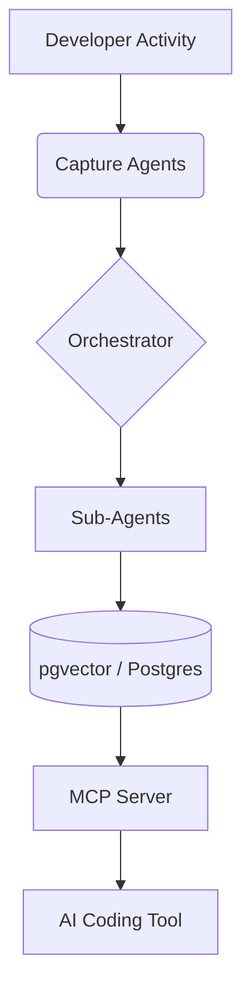

# System Architecture - TraceContext

## Overview
TraceContext is a multi-agent orchestration system that captures developer intent and provides persistent context to AI tools.

## Components

### 1. Capture Layer (Passive)
- **IDE Extension (AGT-001)**: VSCode/Cursor extension that captures edits, cursor movements, and inline chats. Communicates via WebSockets to the local daemon.
- **Git Hook (AGT-002)**: Script that triggers on commit/push to capture diffs and intent signals.
- **Conversation Harvester (AGT-003)**: MCP proxy that extracts rationale from AI interactions.

### 2. Orchestration Layer
- **Master Orchestrator**: LangGraph-based workflow.
    - **Step 1**: Ingest Event.
    - **Step 2**: Route to Specialist (ADR, Dead-End, Map).
    - **Step 3**: Reconcile & Store.
    - **Step 4**: Update Active Context.

### 3. Intelligence Layer (Sub-Agents)
- **Architecture Distiller**: Haiku-based agent that converts events into MADR-format records.
- **Dead-End Tracker**: Detects reversions and logs "why" they failed.
- **Codebase Mapper**: Maintains a semantic index of components.

### 4. Delivery Layer (Active)
- **MCP Server (AGT-007)**: Exposes endpoints for AI tools to fetch "Ranked Context".
- **Context Injector**: Logic to pre-buffer and inject context into system prompts.

## Data Flow


## API Contracts (Draft)

### Event Ingestion
`POST /events`
```json
{
  "type": "git_commit" | "file_edit" | "ai_chat",
  "data": { ... },
  "metadata": { "repo": "...", "user": "..." }
}
```

### Context Retrieval
`GET /context?task=refactor_payment_service`
```json
{
  "rank": 0.95,
  "type": "ADR",
  "content": "Use Dinero.js for monetary values..."
}
```
